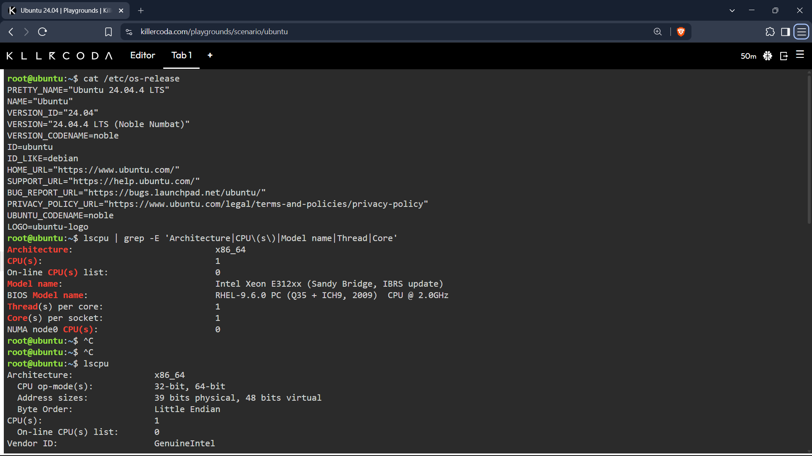
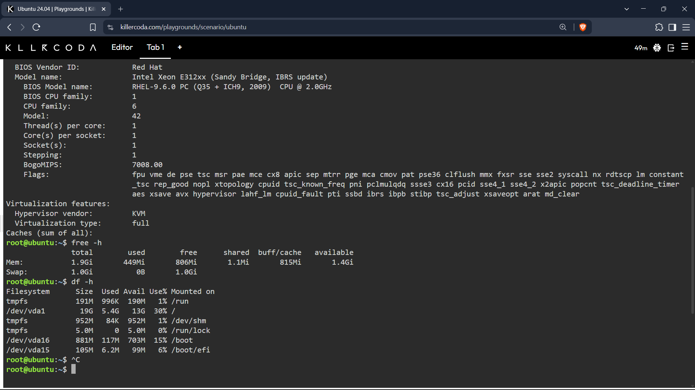

# Continue Your Linux Investigation

## Operating System

### Command used:
```bash
cat /etc/os-release
```
### Output
Operating System: Ubuntu 24.04.4 LTS
---
## CPU Information

### Command used:
```bash
lscpu | grep -E 'Architecture|CPU\(s\)|Model name|Thread|Core'
```
### Output
Architecture: x86_64
CPU: 1 CPU, Intel Xeon E312xx

## Memory

### Command used:
```bash
free -h
```
### Output
Memory: 1.9 GiB RAM

## Disk Space

### Command used:
```bash
df -h
```
### Output
Disk: 19 GB total, about 13 GB available

## Cloud Migration Recommendation

The Linux server investigated in KillerCoda is running **Ubuntu 24.04.4 LTS** on an **x86_64 architecture**. It has **1 CPU**, approximately **1.9 GiB of RAM**, and a **19 GB root disk**, with around **13 GB of available disk space**.

If this Linux server were migrated to the cloud, it could be hosted using the virtual machine services provided by AWS, Microsoft Azure, and Google Cloud Platform.

### Amazon Web Services (AWS)

The server could be hosted using **Amazon Elastic Compute Cloud (Amazon EC2)**. Amazon EC2 provides on-demand virtual servers and allows users to choose instance types with different amounts of CPU, memory, networking, and storage resources. Because this KillerCoda server uses Ubuntu Linux with relatively small CPU, memory, and storage requirements, a small general-purpose or burstable EC2 instance could be selected to provide similar resources. Amazon EC2 also supports Linux operating systems, including Ubuntu-based instances.

### Microsoft Azure

The equivalent Microsoft Azure service is **Azure Virtual Machines**. Azure Virtual Machines provide on-demand and scalable virtualized computing resources and support Linux operating systems. A small Azure VM configuration with approximately 1–2 vCPUs and around 2 GiB of memory would be sufficient to provide resources similar to the KillerCoda server, depending on the application's actual workload. Azure also allows administrators to select the operating system, VM size, networking, and storage required by the server.

### Google Cloud Platform (GCP)

The equivalent Google Cloud service is **Google Compute Engine**. Compute Engine is an Infrastructure as a Service (IaaS) product that provides self-managed virtual machine instances and supports Linux operating systems. A small Compute Engine VM could be configured with CPU, memory, and persistent disk resources similar to the KillerCoda environment. Compute Engine also allows resources to be scaled later if the application's requirements increase.

### Summary

| Cloud Provider | Service That Could Host the Linux Server | Purpose |
|---|---|---|
| **AWS** | **Amazon EC2** | Provides configurable Linux virtual servers with selectable CPU, RAM, storage, and networking resources. |
| **Microsoft Azure** | **Azure Virtual Machines** | Provides scalable Linux virtual machines with configurable compute, storage, and networking. |
| **Google Cloud Platform** | **Compute Engine** | Provides self-managed Linux virtual machines with customizable compute and storage resources. |

Therefore, this Ubuntu Linux server could be migrated to **Amazon EC2 on AWS, Azure Virtual Machines on Microsoft Azure, or Compute Engine on Google Cloud Platform**. Since the current server only has 1 CPU, about 2 GiB of RAM, and 19 GB of disk storage, it would not initially require a large cloud VM. The final VM size should still be selected according to the application's performance, storage, network, availability, and future growth requirements. 

## KillerCoda Terminal Screenshot


