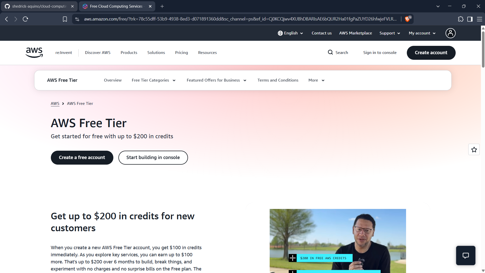

# Amazon Web Services (AWS) Research

## Brief Overview

Amazon Web Services (AWS) is a cloud computing platform provided by Amazon. AWS began offering cloud infrastructure services in 2006 and provides services for computing, storage, networking, databases, security, analytics, artificial intelligence, and many other workloads.

## Global Infrastructure

AWS organizes its global infrastructure into geographic Regions and Availability Zones. As of August 2026, AWS reports 39 geographic Regions and 123 Availability Zones. Multiple Availability Zones within a Region allow organizations to design applications for improved availability and fault tolerance.

## Cloud Management Console

The AWS Management Console is a web-based interface used to access and manage AWS services and resources. Administrators and developers can use it to manage virtual machines, storage, networking, identities, databases, monitoring, and other cloud resources.

## Four Core Services

### 1. Amazon Elastic Compute Cloud (Amazon EC2)
Amazon EC2 provides virtual servers in the AWS Cloud. Organizations can select instance configurations according to their required CPU, memory, operating system, storage, and networking requirements.

### 2. Amazon Simple Storage Service (Amazon S3)
Amazon S3 is an object storage service. Data is stored as objects inside containers known as buckets.

### 3. Amazon Virtual Private Cloud (Amazon VPC)
Amazon VPC enables organizations to create logically isolated virtual networks in AWS. Administrators can configure subnets, IP address ranges, gateways, and routing.

### 4. AWS Identity and Access Management (IAM)
AWS IAM controls authentication and authorization for AWS resources. Administrators can define identities, roles, policies, and permissions to control resource access.

## Three Advantages

1. AWS provides a broad range of cloud and AI services.
2. AWS has extensive global infrastructure that supports globally distributed applications.
3. AWS provides flexible infrastructure that can support small applications as well as large enterprise workloads.

## Typical Enterprise Use Cases

- Hosting websites and enterprise applications
- Virtual machine infrastructure
- Backup and object storage
- Relational and NoSQL databases
- Disaster recovery
- Global e-commerce platforms
- Application scaling
- Data analytics and artificial intelligence
- Kubernetes and containerized applications

## Screenshot

## References

Amazon Web Services. "Our Origins." https://aws.amazon.com/about-aws/our-origins/

Amazon Web Services. "AWS Global Infrastructure." https://aws.amazon.com/about-aws/global-infrastructure/

Amazon Web Services. "Get Started with Amazon EC2." https://docs.aws.amazon.com/AWSEC2/latest/UserGuide/EC2_GetStarted.html

Amazon Web Services. "Getting Started with Amazon S3." https://docs.aws.amazon.com/AmazonS3/latest/userguide/GetStartedWithS3.html

Amazon Web Services. "What is Amazon VPC?" https://docs.aws.amazon.com/vpc/latest/userguide/what-is-amazon-vpc.html

Amazon Web Services. "What is IAM?" https://docs.aws.amazon.com/IAM/latest/UserGuide/introduction.html