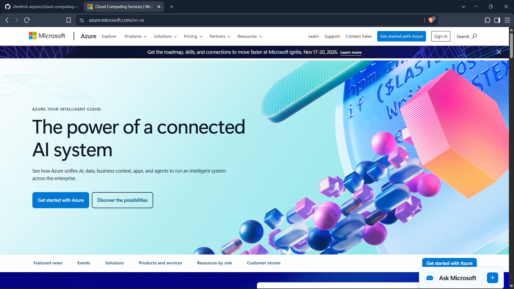

# Microsoft Azure Research

## Brief Overview

Microsoft Azure is Microsoft's cloud computing platform. Azure was launched in 2010 and provides cloud services for virtual machines, storage, networking, databases, security, artificial intelligence, application development, and hybrid cloud environments.

## Global Infrastructure

Microsoft Azure operates a worldwide cloud infrastructure. As of August 2026, Microsoft reports more than 80 Azure regions. Its worldwide infrastructure allows organizations to deploy resources closer to users and meet different availability and data residency requirements.

## Cloud Management Console

The Microsoft Azure Portal is a web-based unified console for building, deploying, monitoring, and managing Azure resources. It can be used to manage virtual machines, storage, networks, databases, identities, and other services.

## Four Core Services

### 1. Azure Virtual Machines
Azure Virtual Machines provide on-demand and scalable computing resources. Both Windows and Linux virtual machines can be deployed.

### 2. Azure Blob Storage
Azure Blob Storage is Microsoft's object storage service and is designed for large quantities of unstructured information such as documents, images, media, logs, and backups.

### 3. Azure Virtual Network
Azure Virtual Network provides private networking for Azure resources and allows resources to communicate with each other, the internet, and on-premises networks.

### 4. Microsoft Entra ID
Microsoft Entra ID is Microsoft's cloud-based identity and access management service. It provides authentication and access controls for users, devices, applications, and resources.

## Three Advantages

1. Strong integration with Microsoft products and services.
2. Strong support for hybrid cloud and existing enterprise environments.
3. Large global cloud infrastructure with services for Windows, Linux, databases, AI, networking, and security.

## Typical Enterprise Use Cases

- Migrating Windows Server workloads
- Microsoft 365 identity integration
- Hybrid cloud environments
- Hosting enterprise applications
- SQL Server and database workloads
- Backup and disaster recovery
- Virtual desktop infrastructure
- Kubernetes and containerized applications

## Screenshot

## References

Microsoft. "What is Azure?" https://azure.microsoft.com/resources/cloud-computing-dictionary/what-is-azure

Microsoft. "Azure Global Infrastructure." https://azure.microsoft.com/explore/global-infrastructure

Microsoft. "Microsoft Azure Portal." https://azure.microsoft.com/get-started/azure-portal

Microsoft. "Overview of Virtual Machines in Azure." https://learn.microsoft.com/azure/virtual-machines/overview

Microsoft. "Introduction to Azure Blob Storage." https://learn.microsoft.com/azure/storage/blobs/storage-blobs-introduction

Microsoft. "What is Azure Virtual Network?" https://learn.microsoft.com/azure/virtual-network/virtual-networks-overview

Microsoft. "Microsoft Entra Product Family." https://learn.microsoft.com/entra/fundamentals/what-is-entra