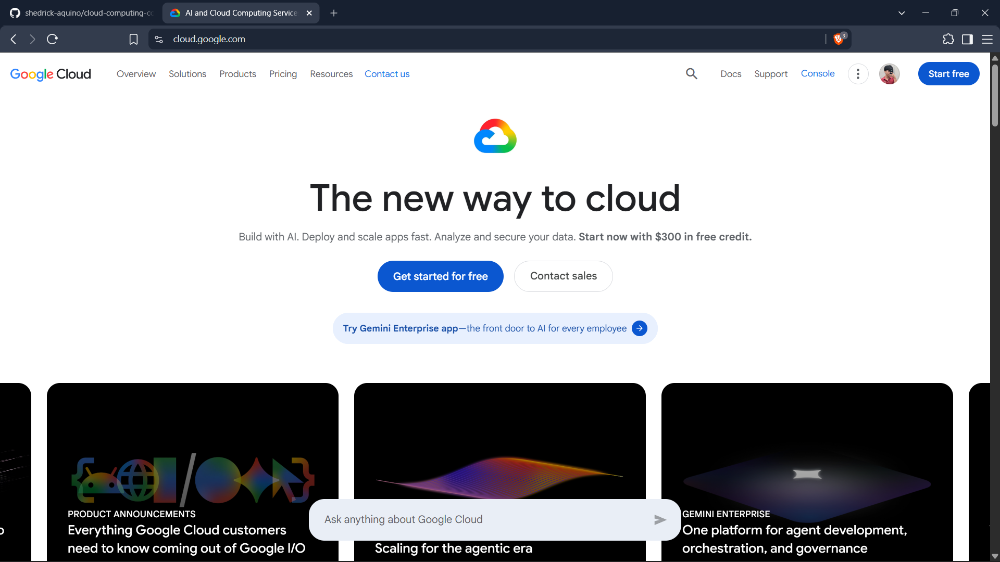

# Google Cloud Platform (GCP) Research

## Brief Overview

Google Cloud is Google's cloud computing platform. One of the platform's early cloud services, Google App Engine, was introduced in 2008. Google Cloud now provides services for compute, storage, networking, databases, analytics, artificial intelligence, machine learning, and Kubernetes.

## Global Infrastructure

Google Cloud operates cloud infrastructure around the world. As of August 2026, Google Cloud reports 43 global regions and 130 zones across six continents.

## Cloud Management Console

The Google Cloud Console is the web-based administration interface for Google Cloud. It provides access to projects, resources, billing information, APIs, Cloud Shell, and cloud resource management tools.

## Four Core Services

### 1. Compute Engine
Compute Engine provides virtual machines running on Google's cloud infrastructure. Organizations can choose configurations with CPUs, GPUs, TPUs, disks, and other resources.

### 2. Cloud Storage
Cloud Storage is Google's scalable managed object storage service. Objects are stored in containers called buckets.

### 3. Virtual Private Cloud (VPC)
Google Cloud VPC provides networking capabilities for Google Cloud resources, including Compute Engine virtual machines and Google Kubernetes Engine workloads.

### 4. Identity and Access Management (IAM)
Google Cloud IAM provides authorization and access control for cloud resources. Administrators can determine who can perform specific actions on particular resources.

## Three Advantages

1. Strong artificial intelligence and machine learning ecosystem.
2. Strong Kubernetes and container technology ecosystem.
3. Strong data analytics and globally distributed infrastructure.

## Typical Enterprise Use Cases

- Artificial intelligence and machine learning
- High-performance computing
- Kubernetes and container platforms
- Data analytics
- Web and mobile application hosting
- Object storage and backup
- Virtual machines
- Cloud-native application development

## Screenshot

## References

Google Cloud. "Global Locations - Regions & Zones." https://cloud.google.com/about/locations

Google Cloud. "Compute Engine." https://cloud.google.com/products/compute

Google Cloud. "Cloud Storage Overview." https://docs.cloud.google.com/storage/docs/introduction

Google Cloud. "IAM Overview." https://docs.cloud.google.com/iam/docs/overview

Google Cloud. "AI and Machine Learning Products." https://cloud.google.com/products/ai

Google Cloud. "Reflecting on Our Ten Year App Engine Journey." https://cloud.google.com/blog/products/gcp/reflecting-on-our-ten-year-app-engine-journey